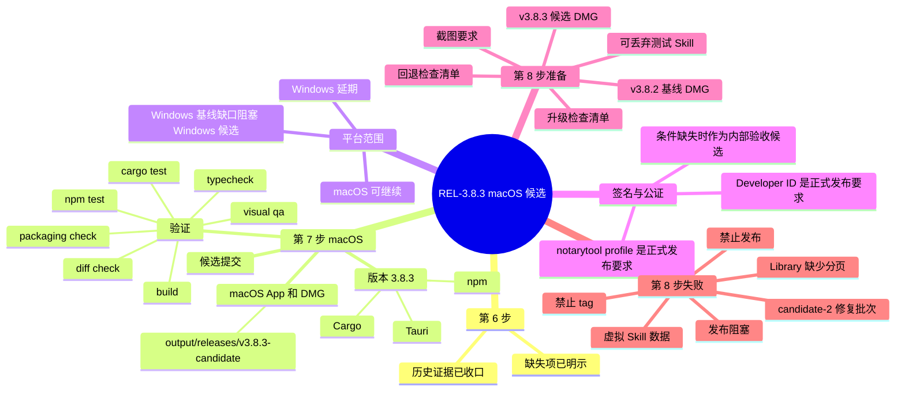

# SOP 脑图

```mermaid
mindmap
  root((REL-3.8.3 macOS 候选))
    第 6 步
      历史证据已收口
      缺失项已明示
    第 7 步 macOS
      版本 3.8.3
        npm
        Tauri
        Cargo
      验证
        npm test
        typecheck
        build
        packaging check
        cargo test
        visual qa
        diff check
      候选提交
      macOS App 和 DMG
        output/releases/v3.8.3-candidate
    平台范围
      macOS 可继续
      Windows 延期
      Windows 基线缺口阻塞 Windows 候选
    签名与公证
      Developer ID 是正式发布要求
      notarytool profile 是正式发布要求
      条件缺失时作为内部验收候选
    第 8 步准备
      v3.8.2 基线 DMG
      v3.8.3 候选 DMG
      可丢弃测试 Skill
      升级检查清单
      回退检查清单
      截图要求
    第 8 步失败
      虚拟 Skill 数据
      Library 缺少分页
      发布阻塞
      candidate-2 修复批次
      禁止 tag
      禁止发布
```
