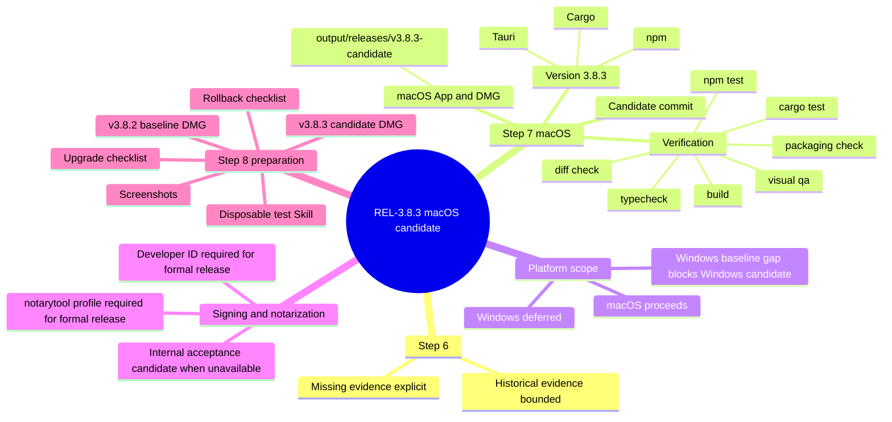

# SOP Mindmap

```mermaid
mindmap
  root((REL-3.8.3 macOS candidate))
    Step 6
      Historical evidence bounded
      Missing evidence explicit
    Step 7 macOS
      Version 3.8.3
        npm
        Tauri
        Cargo
      Verification
        npm test
        typecheck
        build
        packaging check
        cargo test
        visual qa
        diff check
      Candidate commit
      macOS App and DMG
        output/releases/v3.8.3-candidate
    Platform scope
      macOS proceeds
      Windows deferred
      Windows baseline gap blocks Windows candidate
    Signing and notarization
      Developer ID required for formal release
      notarytool profile required for formal release
      Internal acceptance candidate when unavailable
    Step 8 preparation
      v3.8.2 baseline DMG
      v3.8.3 candidate DMG
      Disposable test Skill
      Upgrade checklist
      Rollback checklist
      Screenshots
```
