# Skill Panel 详细用户流程图

这份笔记描述用户从安装 Skill Panel、扫描本机 Skill、查找、查看、新建、编辑、备份、设置 AI 到处理错误的完整过程。

关联文档：[[../日常总结/01-Skill-Panel执行SOP]]

> [!important] 流程图状态说明
> 🟢 当前已连接真实能力；🟡 当前部分连接、使用内存状态或需要桌面复核；🔴 当前主要是页面展示或仍需开发；🔵 系统自动执行；⚪ 用户确认节点。

---

## 一、用户全流程总图

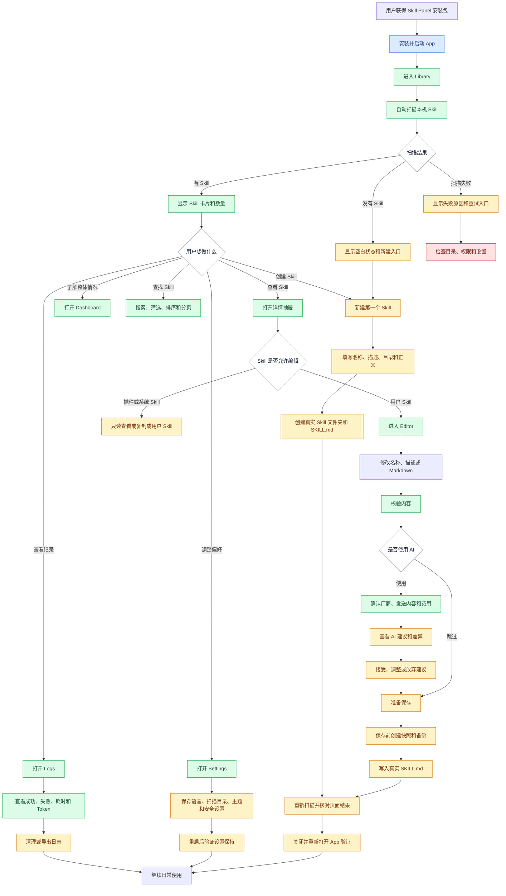

### 总流程中的当前关键情况

| 流程段 | 当前状态 | 用户现在会遇到什么 |
|---|---|---|
| 打开 Library 并扫描 | 🟢 桌面真实 / 🧪 浏览器模拟 | 桌面读取本机目录，浏览器显示示例 Skill |
| Dashboard | 🟢 | 指标来自当前 Skill 列表 |
| 搜索、筛选、分页 | 🟢 | 当前页面内可正常操作 |
| 详情抽屉 | 🟡 | 可以查看摘要，部分按钮还未连接真实操作 |
| 新建 Skill | 🟡 | 已调用真实命令，默认 `~` 目录需要修正和桌面验证 |
| Editor 读取 | 🟢 | 能读取选中 Skill 的 Markdown |
| Editor 保存 | 🔴 | 当前正式页面还没有写入真实文件 |
| Settings 普通设置 | 🔴 | 多数设置只在当前内存变化 |
| AI Key | 🟢 | 写入系统 Keychain |
| AI 优化 | 🟡 | 能发送和显示结果，确认差异与写入流程仍需补齐 |
| Logs | 🟡 | 能读取日志文件，完整写入和清理流程需要确认 |

---

## 二、首次安装和启动流程

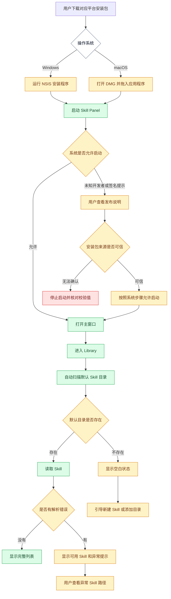

### 用户需要看到的信息

| 阶段 | 页面要显示什么 | 用户要确认什么 |
|---|---|---|
| 下载 | 平台、版本、处理器类型、校验值 | 文件来自正式发布位置 |
| 安装 | App 名称、图标、安装位置 | 没有安装到意外目录 |
| 首次启动 | 当前版本、扫描状态 | 启动的是刚安装的版本 |
| 首次扫描 | 扫描目录、数量、完成时间 | 扫描的是自己的真实目录 |
| 扫描异常 | 失败路径、原因、重试动作 | 是否需要授权或修复文件 |

### 当前项目发布前需要补齐

- 生成 3.8.0 Windows 和 macOS 候选安装包。
- 确认品牌图标。
- 准备 Windows 签名和 macOS 公证说明。
- 验证从旧版升级后的设置和 Skill 数据。
- 在安装版中逐页完成真实操作。

---

## 三、启动扫描详细流程

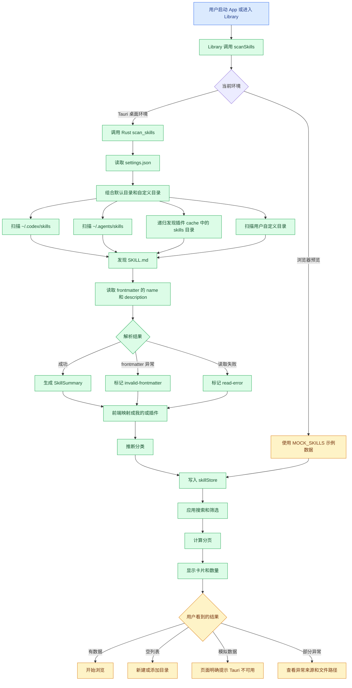

### 扫描结果审核表

| 用户看到的内容 | 数据来源 | 当前风险 |
|---|---|---|
| Skill 总数 | 当前 `skillStore.skills` | 模拟回退也会产生数量 |
| “我的”数量 | Codex、Agents、自定义目录映射 | 来源被压缩后细节减少 |
| “插件”数量 | plugin-cache、system、unknown 映射 | unknown 也会进入插件保护 |
| 分类 | frontmatter、标签、路径、名称、描述推断 | Rust 当前摘要未完整返回分类字段 |
| 修改时间 | 文件系统时间戳字符串 | 前端显示格式需要统一 |
| 文件大小 | 当前页面模型中常为 0 | 详情抽屉可能显示 0 KB |

### 扫描失败分支

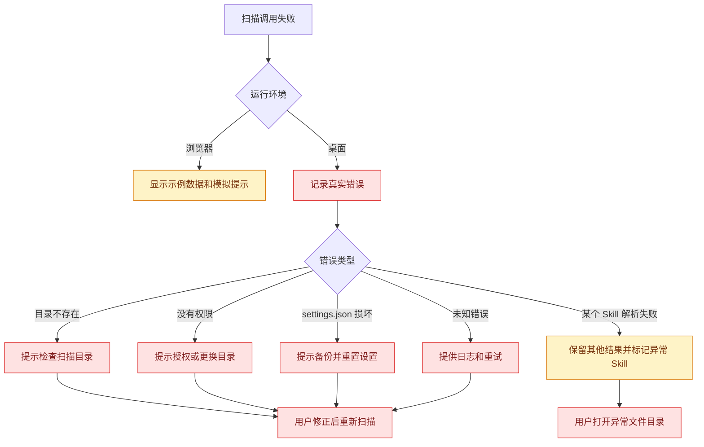

---

## 四、Library 浏览和查找流程

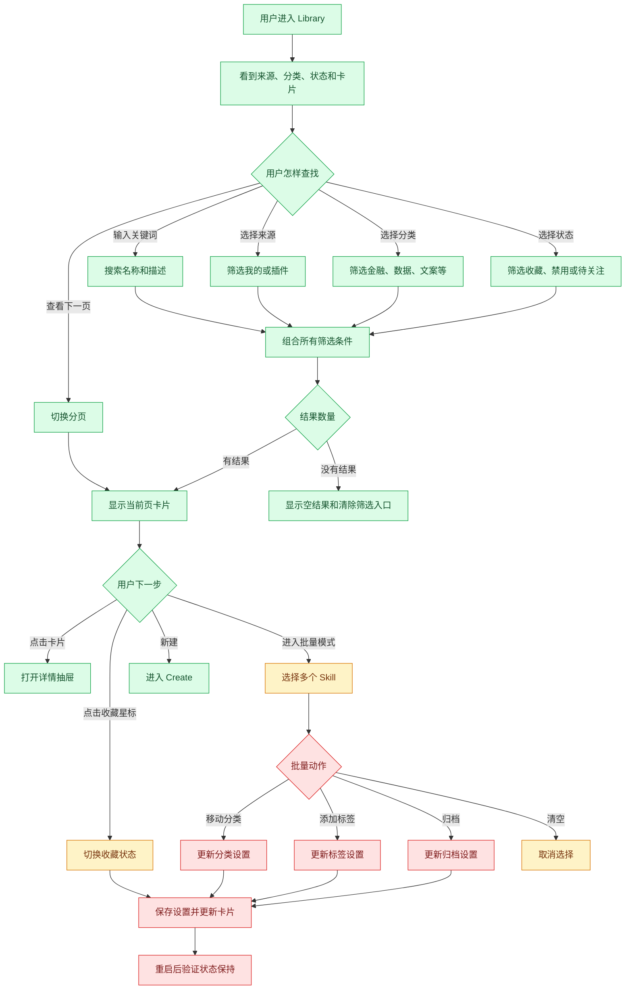

### Library 当前按钮状态

| 操作 | 当前用户结果 | 当前状态 |
|---|---|---|
| 搜索名称和描述 | 立即过滤卡片 | 🟢 |
| 来源筛选 | 立即过滤卡片 | 🟢 |
| 分类筛选 | 立即过滤卡片 | 🟢，分类推断还需加强 |
| 收藏 | 当前页面星标变化 | 🟡，重启后可能丢失 |
| 分页 | 切换 8 个一页 | 🟢 |
| 打开详情 | 显示详情抽屉 | 🟢 |
| 批量全选和清空 | 更新当前选择 | 🟢 页面内状态 |
| 批量移动分类 | 当前按钮缺少处理 | 🔴 |
| 批量加标签 | 当前按钮缺少处理 | 🔴 |
| 批量归档 | 显示 Toast 并退出批量 | 🔴，没有持久化 |
| 网格和列表切换 | 当前图标缺少处理 | 🔴 |
| 最近修改排序 | 当前按钮缺少处理 | 🔴 |

### 详情抽屉流程

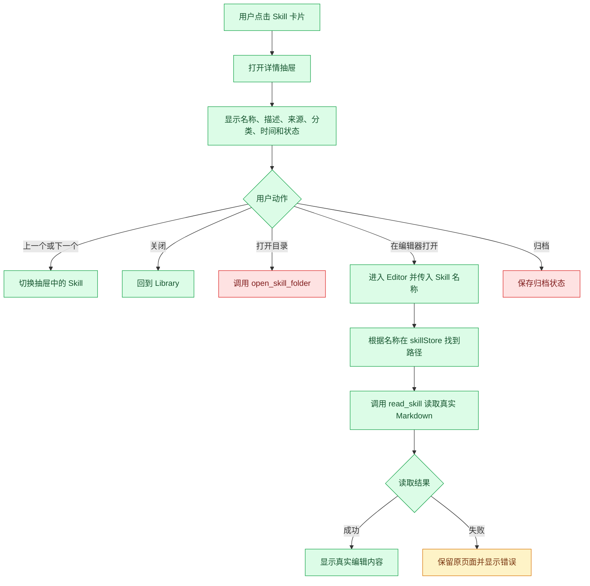

---

## 五、新建 Skill 详细流程

### 用户目标

在批准的用户 Skill 目录中创建一个新的文件夹和 `SKILL.md`。

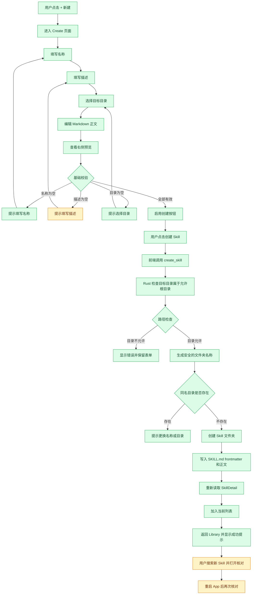

### 新建流程当前注意点

| 项目 | 当前情况 | 需要补齐 |
|---|---|---|
| 默认名称 | `my-awesome-skill` | 用户可修改，创建前检查重复 |
| 默认目录 | `~/.codex/skills` | 转成绝对路径后再传给 Rust |
| 描述 | 页面允许为空，Rust 要求非空 | 前后端校验统一 |
| 分类 | 页面可以选择 | 当前创建输入没有保存分类字段 |
| 正文 | 会写入 Markdown | 检查 frontmatter 和正文是否重复 |
| 创建后 | 加入当前列表 | 还要重新扫描磁盘确认 |
| 失败 | 页面显示后端错误 | 保留全部表单内容 |

### 创建完成标准

- [ ] 目标目录显示为完整绝对路径。
- [ ] 名称、描述和正文校验一致。
- [ ] 磁盘出现新的 Skill 文件夹和 `SKILL.md`。
- [ ] Library 能搜索到新 Skill。
- [ ] 关闭并重新打开 App 后仍然存在。
- [ ] 创建失败时不会留下半成品目录。

---

## 六、编辑、校验、AI 和保存流程

### 当前编辑流程

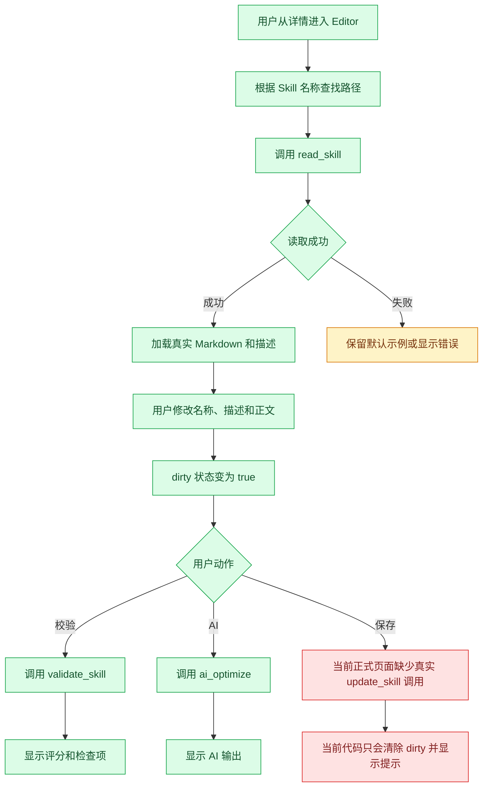

### 目标完整保存流程

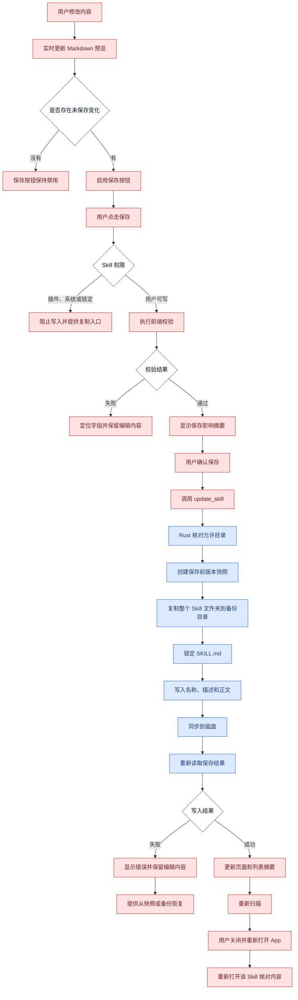

### 编辑页面审核表

| 区域 | 用户要确认什么 | 当前状态 |
|---|---|---|
| 左栏文件列表 | 显示该 Skill 真实文件 | 🔴 当前多为固定示例 |
| 名称 | 修改后 frontmatter `name` 同步 | 🟡 页面可改，真实保存未连接 |
| 分类 | 修改后保存到设置或 frontmatter | 🔴 |
| 描述 | 修改后 frontmatter `description` 同步 | 🟡 |
| Markdown | 读取和编辑真实正文 | 🟢 读取，🔴 保存 |
| 右侧预览 | 随当前 Markdown 实时变化 | 🔴 当前内容主要固定 |
| 校验 | 对当前 Skill 文件运行规则 | 🟢 |
| AI | 发送内容并显示建议 | 🟡 |
| 保存 | 快照、备份、写入、重扫 | 🔴 当前正式页面未连接 |

---

## 七、AI 优化详细流程

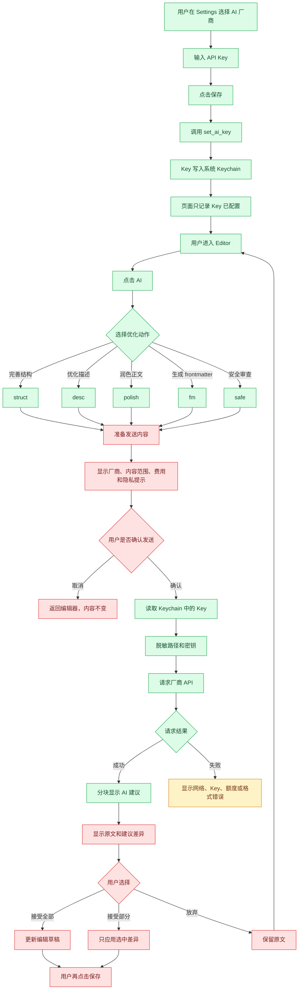

### AI 流程当前风险

| 风险 | 用户影响 | 流程要求 |
|---|---|---|
| Editor 当前固定使用 `glm` | 设置中选了其他厂商也可能调用 GLM | 使用 Settings 中的真实厂商 |
| 发送确认不完整 | 用户不知道正文会发到哪里 | 每次显示厂商、范围和费用 |
| 脱敏范围有限 | 邮箱或其他密钥格式可能保留 | 扩展规则并允许用户预览发送内容 |
| 厂商请求格式不同 | Claude、Ollama 等可能调用失败 | 每家厂商单独测试 |
| AI 结果缺少 diff 接受 | 用户难以控制写入范围 | 增加差异视图和逐项接受 |
| 调用成本显示为固定示例 | 用户无法知道真实费用 | 根据真实请求统计 |

---

## 八、Settings 设置流程

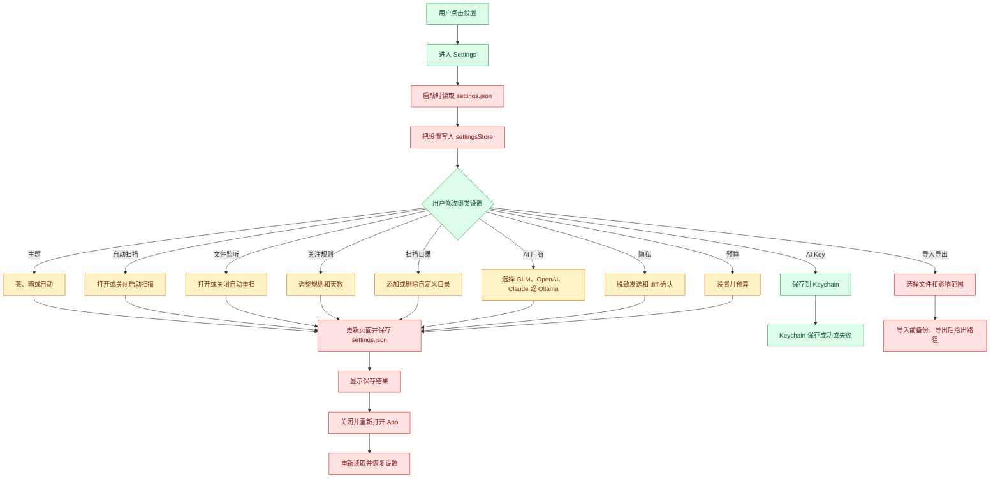

### Settings 当前状态表

| 设置 | 当前页面操作 | 是否写入磁盘 |
|---|---|---|
| 主题 | 更新 `settingsStore.theme` | 🔴 当前普通设置未统一保存 |
| 启动自动扫描 | 更新内存开关 | 🔴 |
| 文件监听 | 更新内存开关 | 🔴，AppShell 仍会启动监听调用 |
| 关注规则 | 更新内存数组 | 🔴 |
| 自定义扫描目录 | 当前页面没有完整管理界面 | 🔴 |
| AI 厂商 | 更新内存 | 🟡，Editor 当前固定使用 GLM |
| AI Key | 写入系统 Keychain | 🟢 |
| 脱敏发送 | 更新内存 | 🔴，Rust 当前总会执行基础脱敏 |
| diff 确认 | 更新内存 | 🔴，Editor 未实现差异接受 |
| 月预算 | 更新内存 | 🔴，已用金额是页面示例 |
| 导入和导出 | 按钮已显示 | 🔴，缺少处理 |

### 设置保存完成标准

- [ ] 启动时调用 `load_app_settings`。
- [ ] 修改普通设置后调用 `save_app_settings`。
- [ ] 设置保存失败时恢复页面旧值。
- [ ] 重启后所有设置保持。
- [ ] AI Key 明文只进入 Keychain。
- [ ] 设置损坏时提供备份和重置。

---

## 九、归档、删除、备份和恢复流程

### 归档流程

归档只隐藏或标记 Skill，保留真实文件。

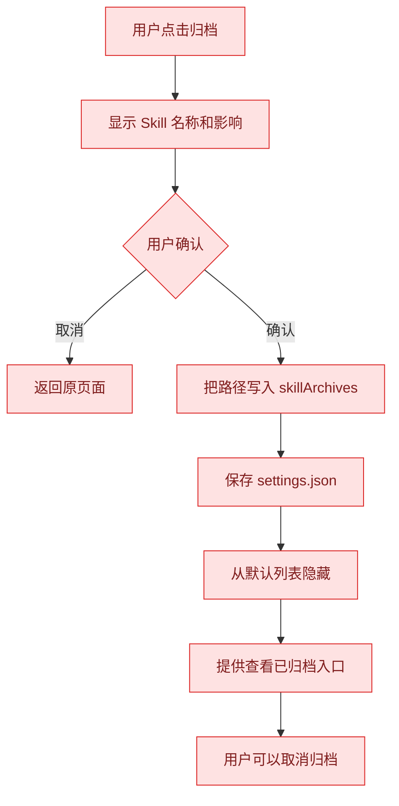

当前 AppShell 的归档按钮主要显示 Toast，还没有保存 `skillArchives`。

### 删除流程

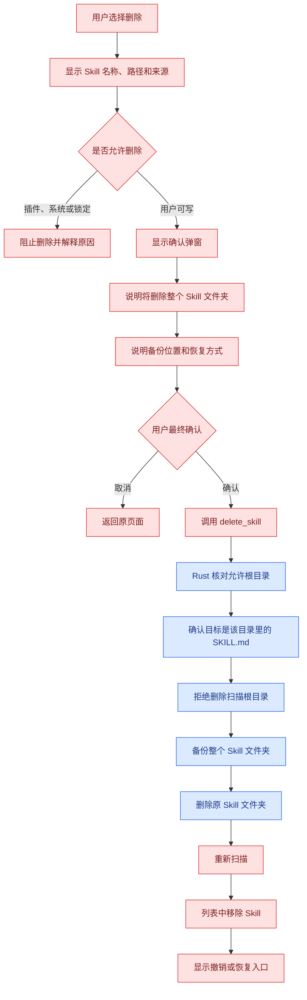

### 版本恢复流程

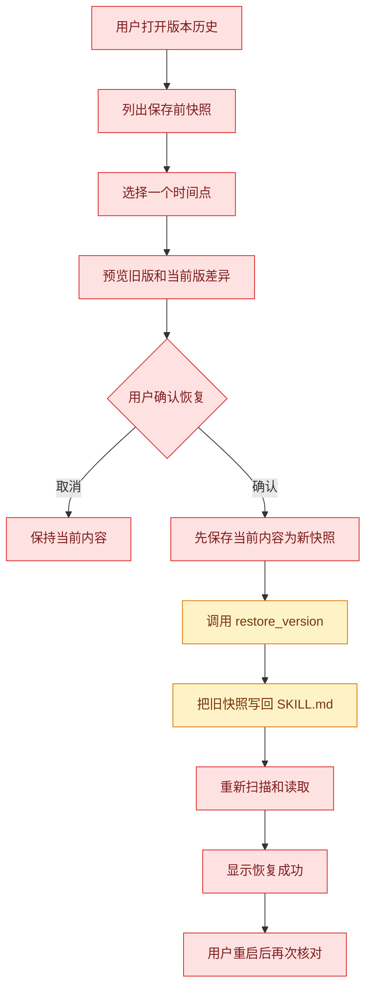

### 危险操作完成标准

- [ ] 归档和删除有不同文字、颜色和结果。
- [ ] 插件、系统和锁定 Skill 在 Rust 层得到保护。
- [ ] 删除前展示完整路径和备份位置。
- [ ] 删除失败时原文件保持。
- [ ] 恢复前保存当前版本。
- [ ] 用户能从界面找到备份和版本历史。

---

## 十、文件自动监听流程

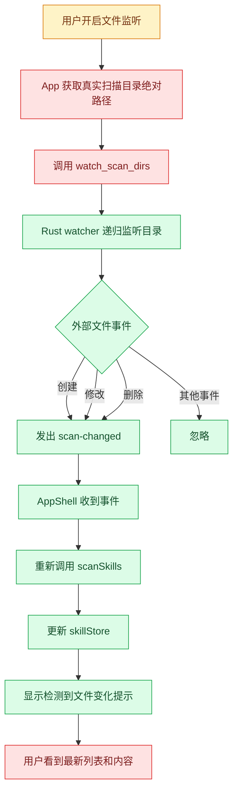

### 当前需要修正

AppShell 传入的默认目录是：

```text
~/.codex/skills
~/.agents/skills
~/.codex/plugins/cache
```

Rust watcher 使用普通路径判断是否存在。`~` 没有在当前流程中展开成用户主目录，默认监听可能没有真正启动。

目标流程要先获得绝对路径，例如：

```text
/Users/用户名/.codex/skills
/Users/用户名/.agents/skills
/Users/用户名/.codex/plugins/cache
```

---

## 十一、Logs 调用日志流程

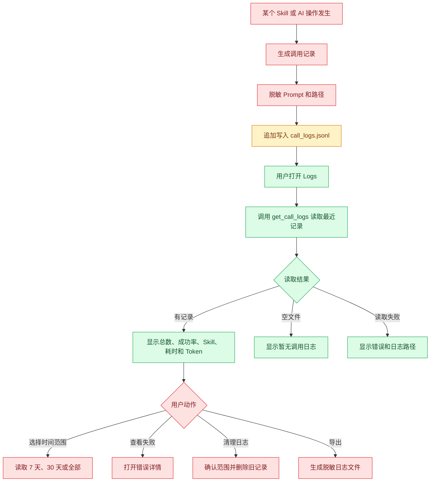

### 当前情况

- Logs 页面已经调用 `get_call_logs('7d')`。
- Rust 会读取 `~/.codex/skill-panel/call_logs.jsonl`。
- 文件不存在时返回空列表。
- 浏览器环境会显示三条模拟日志。
- `range = 7d` 当前按最多 50 条处理，尚未按真实日期过滤。
- App 内的完整日志写入来源还需要统一。
- 清理、导出和隐私开关还需要实现。

---

## 十二、用户错误恢复总图

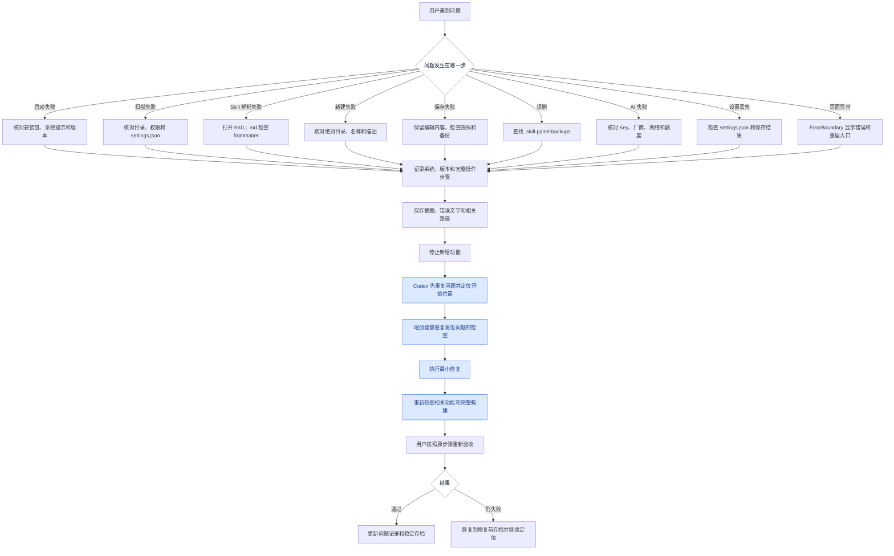

### 用户报告问题模板

```text
Skill Panel 版本：
操作系统和版本：
安装版或开发版：
发生问题的页面：
Skill 来源：Codex / Agents / 插件 / 自定义目录
Skill 完整路径：
我从哪个页面开始：
我依次点击了什么：
我输入了什么：
我期望看到什么：
实际看到什么：
是否影响真实文件：
快照或备份是否存在：
错误文字：
截图或录屏：
```

---

## 十三、按用户目标快速查流程

| 用户目标 | 从哪里开始 | 主要流程 | 当前完成度 |
|---|---|---|---|
| 看本机有多少 Skill | 启动 App | Library 扫描 → Dashboard | 🟢 |
| 找到某个 Skill | Library | 搜索 → 筛选 → 分页 | 🟢 |
| 查看 Skill 信息 | Library | 点击卡片 → 详情抽屉 | 🟢 摘要 |
| 查看完整 Markdown | 详情抽屉 | 在编辑器打开 → read_skill | 🟢 读取 |
| 新建 Skill | 顶栏 | + 新建 → 表单 → create_skill | 🟡 路径需修正 |
| 编辑并保存 | Editor | 修改 → 校验 → 快照 → update_skill | 🔴 保存待连接 |
| 打开文件夹 | 详情抽屉 | 打开目录 → open_skill_folder | 🔴 待连接 |
| 收藏 | Library | 点击星标 → 保存设置 | 🟡 当前内存 |
| 归档 | Library | 归档 → skillArchives → 保存设置 | 🔴 待连接 |
| 批量整理 | Library | 批量选择 → 分类/标签/归档 | 🔴 待连接 |
| 修改主题 | Settings | 选择主题 → 保存 → 重启恢复 | 🔴 待连接 |
| 添加扫描目录 | Settings | 选择目录 → 保存 → 重扫 | 🔴 待连接 |
| 保存 AI Key | Settings | 输入 Key → Keychain | 🟢 |
| 使用 AI 优化 | Editor | 选择动作 → 确认发送 → diff → 保存 | 🟡 |
| 查看调用日志 | Logs | get_call_logs → 表格 | 🟡 |
| 恢复旧版本 | 版本历史 | 预览差异 → 快照当前版 → 恢复 | 🟡 底层有能力 |
| 删除 Skill | 详情或批量 | 权限检查 → 备份 → 删除 → 重扫 | 🔴 当前页面待连接 |

---

## 十四、3.8.0 用户流程验收清单

### 启动和扫描

- [ ] 安装 3.8.0 后首次启动成功。
- [ ] App 内显示版本 3.8.0。
- [ ] 默认扫描目录显示为绝对路径。
- [ ] 扫描数量与磁盘实际 Skill 数量一致。
- [ ] 空目录显示新建和添加目录入口。
- [ ] 解析错误显示具体 Skill 和处理入口。
- [ ] 浏览器模拟数据有明显标记。

### Library

- [ ] 搜索名称和描述正确。
- [ ] 来源、分类和状态筛选正确。
- [ ] 多个筛选组合结果正确。
- [ ] 清空筛选回到第一页。
- [ ] 分页范围和总数正确。
- [ ] 详情抽屉显示真实路径和解析状态。
- [ ] 收藏、归档、分类和标签在重启后保持。

### 新建

- [ ] 使用绝对目标目录。
- [ ] 名称、描述和正文校验清楚。
- [ ] 同名目录得到明确提示。
- [ ] 创建后磁盘出现真实文件。
- [ ] 创建失败不留下半成品。
- [ ] 重启后新 Skill 仍能扫描到。

### 编辑和保存

- [ ] Editor 显示选中 Skill 的真实 Markdown。
- [ ] 预览随着正文变化。
- [ ] 只读 Skill 无法保存。
- [ ] 保存前显示影响摘要。
- [ ] 保存前创建版本快照和文件夹备份。
- [ ] 保存后磁盘内容正确。
- [ ] 重启后修改仍然存在。
- [ ] 保存失败时编辑内容保留。

### AI

- [ ] AI Key 只保存在系统 Keychain。
- [ ] Editor 使用 Settings 中选择的厂商。
- [ ] 每次发送前显示厂商、内容和费用。
- [ ] 用户能预览脱敏后的发送内容。
- [ ] AI 建议通过 diff 接受或放弃。
- [ ] 放弃建议不会修改原文。

### 设置和监听

- [ ] 启动时加载 `settings.json`。
- [ ] 主题、扫描目录、监听和规则可以保存。
- [ ] 重启后设置保持。
- [ ] 外部修改 `SKILL.md` 后列表自动刷新。
- [ ] 设置文件损坏时提供备份和重置。

### 删除和恢复

- [ ] 归档不会删除真实文件。
- [ ] 插件、系统和锁定 Skill 得到保护。
- [ ] 删除前显示完整路径和备份位置。
- [ ] 删除前备份整个 Skill 文件夹。
- [ ] 用户能从备份恢复误删 Skill。
- [ ] 恢复旧版本前保存当前版本。

### 安装和升级

- [ ] Windows 候选包完成安装、升级和卸载。
- [ ] macOS 候选包完成安装、升级和卸载。
- [ ] 升级后旧 Skill、设置和 Keychain 状态符合说明。
- [ ] 旧稳定版回退流程可以执行。
- [ ] 安装包、测试报告和代码存档一一对应。

> [!success] 使用这份流程图的方法
> 开发一个功能前，先找到对应流程图中的起点和结束点；把中间每个红色或黄色节点拆成独立任务；完成后使用本页验收清单亲自操作。每次只让一个流程从红色变成绿色，Skill Panel 的真实完成度会非常清楚。
